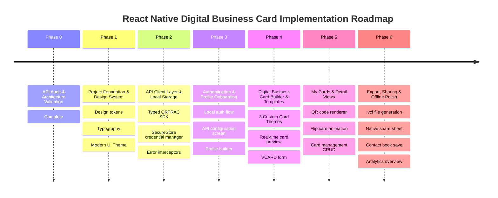

# QRTRAC API Technical Audit & Architecture Validation

**Project:** React Native Digital Business Card Application  
**API Documentation Reference:** [https://apidocs.qrtrac.com/](https://apidocs.qrtrac.com/)  
**Production Base URL:** `https://api.qrtrac.com/api`  
**API Version:** 2.0.0 (OpenAPI 3.0.0 Specification)  
**Audit Date:** August 2026  
**Status:** Phase 0 Completed — API Audit & Architectural Conflict Assessment

---

## Table of Contents

1. [Executive Summary](#1-executive-summary)
2. [Authentication & Credentials](#2-authentication--credentials)
3. [Base URL & Environment Configuration](#3-base-url--environment-configuration)
4. [Complete Endpoint Catalog](#4-complete-endpoint-catalog)
5. [Request Headers & Authentication Protocol](#5-request-headers--authentication-protocol)
6. [Request Bodies & Data Schemas](#6-request-bodies--data-schemas)
7. [Response Structures & Data Envelopes](#7-response-structures--data-envelopes)
8. [Error Responses & HTTP Status Codes](#8-error-responses--http-status-codes)
9. [Rate Limits & Subscription Tiers](#9-rate-limits--subscription-tiers)
10. [Supported QR Types](#10-supported-qr-types)
11. [Digital Business Card (VCARD) Analysis](#11-digital-business-card-vcard-analysis)
12. [Template Support Analysis](#12-template-support-analysis)
13. [Public URL & QR Image Behavior](#13-public-url--qr-image-behavior)
14. [Security Audit & Architectural Conflict](#14-security-audit--architectural-conflict)
15. [Unknown, Missing & Unconfirmed Requirements](#15-unknown-missing--unconfirmed-requirements)
16. [Architecture Comparison & Recommendation](#16-architecture-comparison--recommendation)
17. [Proposed Implementation Plan](#17-proposed-implementation-plan)

---

## 1. Executive Summary

A comprehensive technical audit of the official QRTRAC API specification (`https://apidocs.qrtrac.com/`) was performed to evaluate its capabilities, endpoints, data contracts, and architectural compatibility with a React Native Digital Business Card application.

### Key Findings:

1. **No End-User Authentication API**: QRTRAC is strictly an enterprise/developer B2B REST API. It uses static organization-level credentials (`Client ID`, `Client Secret`, `Team ID`). There are **no user login endpoints** (e.g. no `/auth/login`, `/users/signin`, email/password, or OAuth PKCE flows).
2. **Fundamental Architectural Conflict**: The assignment mandates two conflicting rules:
   - *"Do not build a separate backend."*
   - *"Never expose API keys in source code."*
   Because QRTRAC requires the sensitive `x-request-client-secret` header on all management endpoints, calling QRTRAC directly from React Native without a backend inevitably exposes the secret in the client binary or requires runtime injection.
3. **VCARD Representation**: VCARD is supported under `qrType: "VCARD"`. Field definitions (`firstName`, `lastName`, `company`, `designation`, `email`, `mobile`, `landline`, `fax`, `website`, `address`, `bio`, etc.) are documented in the API creation example at the payload level, while schema metadata is stored in a flexible `metadata` object.
4. **Template Support**: QRTRAC templates (`GET /qr-templates-api`) control the **visual design of the QR Code image** (colors, logo, shapes), **not** the mobile digital business card UI layout. The application's digital business card themes must therefore be managed locally within React Native.

---

## 2. Authentication & Credentials

QRTRAC utilizes static header-based API key authentication scoped to organizations and teams.

| Credential | Header Name | Type | Description |
| :--- | :--- | :--- | :--- |
| **Team ID** | `x-request-team-id` | `string` | Identifies the organizational team context for the request. |
| **Client ID** | `x-request-client-id` | `string` | Public/developer identifier obtained from `app.qrtrac.com/pages/api`. |
| **Client Secret** | `x-request-client-secret` | `string` | High-privilege API secret obtained from `app.qrtrac.com/pages/api`. |

### Access Requirements:
- **Subscription Plan:** Business Plus plan or higher (API access is strictly unavailable on free/lower tiers).
- **User Role:** Must possess an **Owner** or **Admin** role in the QRTRAC organization to generate credentials.
- **Expiration / Tokens:** QRTRAC does not issue ephemeral session tokens, JWTs, or refresh tokens. Credentials remain static until manually regenerated in the dashboard.

---

## 3. Base URL & Environment Configuration

- **Production Server:** `https://api.qrtrac.com/api`
- **Custom Domains:** QRTRAC supports custom short URL base domains via the `baseUrl` parameter during QR creation (e.g., `https://qr.example.com/`). The `baseUrl` must end with a trailing slash (`/`) and must be pre-configured in the QRTRAC organization dashboard.

---

## 4. Complete Endpoint Catalog

The QRTRAC API exposes 28 distinct operations across 5 primary domains:

### 4.1 QR Code Management (`/qrs-api`)

| Method | Endpoint | Operation ID | Description | Required Headers |
| :--- | :--- | :--- | :--- | :--- |
| `POST` | `/qrs-api` | `createQr` | Create a new dynamic QR code (including VCARD). | `TeamId`, `ClientId`, `ClientSecret` |
| `POST` | `/qrs-api/duplicate/{id}` | `duplicateQr` | Duplicate an existing QR code with a new ID. | `TeamId`, `ClientId`, `ClientSecret` |
| `GET` | `/qrs-api/availability/{id}` | `checkQrAvailability` | Check if a custom `displayId` is available. | *None* |
| `PUT` | `/qrs-api/{id}` | `updateQr` | Update an existing QR code's configuration. | `TeamId`, `ClientId`, `ClientSecret` |
| `DELETE` | `/qrs-api/{id}` | `deleteQr` | Soft-delete a QR code (moves to deleted pool). | `TeamId`, `ClientId`, `ClientSecret` |
| `PUT` | `/qrs-api/{id}/tags` | `updateQrTags` | Update tags assigned to a QR code. | `TeamId`, `ClientId`, `ClientSecret` |
| `PATCH` | `/qrs-api/{id}/title` | `updateQrTitle` | Update only the title/name of a QR code. | `TeamId`, `ClientId`, `ClientSecret` |
| `GET` | `/qrs-api/v2/teams/` | `getTeamQrsPaginated` | List team QR codes with pagination, search, & sorting. | `TeamId` |
| `GET` | `/qrs-api/teams/{id}` | `getQrById` | Retrieve full details of a specific QR code by ID. | *None specified in path* |
| `GET` | `/qrs-api/teams/fromTime/{fromTime}` | `getTeamQrsFromTime` | List team QR codes updated after a timestamp (ms). | `TeamId` |
| `GET` | `/qrs-api/all/fromTime/{fromTime}` | `getAllQrsFromTime` | List all QR codes across teams updated after timestamp. | *None* |

### 4.2 QR Code Design Templates (`/qr-templates-api`)

| Method | Endpoint | Operation ID | Description | Required Headers |
| :--- | :--- | :--- | :--- | :--- |
| `GET` | `/qr-templates-api` | `getQrTemplatesByTeam` | Retrieve QR code visual design templates for team. | `TeamId`, `ClientId`, `ClientSecret` |

### 4.3 Analytics & Tracking (`/analytics-api`)

| Method | Endpoint | Operation ID | Description | Required Headers |
| :--- | :--- | :--- | :--- | :--- |
| `GET` | `/analytics-api/detailed/{id}` | `getQrScanAnalytics` | Retrieve individual scan events for a single QR code. | `TeamId`, `ClientId`, `ClientSecret` |
| `POST` | `/analytics-api/detailed/all` | `getBulkQrAnalytics` | Bulk fetch scan events for multiple QR codes in a time range. | `TeamId`, `ClientId`, `ClientSecret` |
| `POST` | `/analytics-api/overviews` | `getTotalScansOverview` | Fetch total scans, today's scans, and lead counts for QR IDs. | `TeamId`, `ClientId`, `ClientSecret` |

### 4.4 Teams & Organization Management (`/teams-api`)

| Method | Endpoint | Operation ID | Description | Required Headers |
| :--- | :--- | :--- | :--- | :--- |
| `GET` | `/teams-api` | `getAllTeams` | Get all teams in the organization. | `ClientId`, `ClientSecret` |
| `POST` | `/teams-api` | `createTeam` | Create a new team. | `ClientId`, `ClientSecret` |
| `GET` | `/teams-api/{id}` | `getTeamById` | Get details of a specific team by ID. | `TeamId`, `ClientId`, `ClientSecret` |
| `PUT` | `/teams-api/{id}` | `updateTeam` | Update team name or default settings. | `TeamId`, `ClientId`, `ClientSecret` |
| `PUT` | `/teams-api/{id}/domainPreferences` | `updateDomainPreferences` | Update domain preferences for a team. | `TeamId`, `ClientId`, `ClientSecret` |

### 4.5 Team Member Management (`/teams-api/{id}/members`)

| Method | Endpoint | Operation ID | Description | Required Headers |
| :--- | :--- | :--- | :--- | :--- |
| `PUT` | `/teams-api/{id}/members` | `addTeamMember` | Add a member to a team (invite). | `TeamId`, `ClientId`, `ClientSecret` |
| `POST` | `/teams-api/members/bulk` | `bulkAddMembers` | Add member across multiple teams. | `ClientId`, `ClientSecret` |
| `PUT` | `/teams-api/{id}/members/{email}/activate` | `activateMember` | Reactivate a paused member. | `TeamId`, `ClientId`, `ClientSecret` |
| `PUT` | `/teams-api/{id}/members/{email}/pause` | `pauseMember` | Pause a member's access. | `TeamId`, `ClientId`, `ClientSecret` |
| `PUT` | `/teams-api/{id}/members/{email}/changeRole` | `changeMemberRole` | Change member role (admin, editor, viewer). | `TeamId`, `ClientId`, `ClientSecret` |
| `DELETE` | `/teams-api/{id}/members/{email}` | `removeMemberFromTeam` | Remove member from specific team. | `TeamId`, `ClientId`, `ClientSecret` |
| `DELETE` | `/teams-api/{id}/members/{email}/delete` | `deleteMember` | Permanently delete member from organization. | `TeamId`, `ClientId`, `ClientSecret` |
| `GET` | `/teams-api/resend/invite/{email}` | `resendInvite` | Resend invitation email to pending member. | *None specified in path* |

---

## 5. Request Headers & Authentication Protocol

For all standard mutating and protected operations, requests must specify:

```http
POST /api/qrs-api HTTP/1.1
Host: api.qrtrac.com
Content-Type: application/json
x-request-team-id: team_64f1a2b3c4d5e6f
x-request-client-id: cli_98a7b6c5d4e3f21
x-request-client-secret: sec_abcdef0123456789abcdef0123456789
```

---

## 6. Request Bodies & Data Schemas

### 6.1 Base `CreateQrRequest` Schema

```json
{
  "name": "John's Digital Card",
  "qrType": "VCARD",
  "displayId": "john-doe-card",
  "qrRedirectUrl": "https://johndoe.com",
  "templateId": "qwrIYX8iLAuDHSBCiKZl",
  "baseUrl": "https://qr.qrtrac.com/",
  "tags": ["networking", "executive"],
  "metadata": {},
  "settings": {
    "passwordEnabled": false,
    "locationEnabled": false
  }
}
```

- `name` *(string, optional)*: Display name for the card (defaults to `"Untitled"`).
- `qrType` *(string, required)*: Enum (`WEB`, `PDF`, `VCARD`, `MULTI_LOCALE`, `APP_DOWNLOAD`, `LINK_LIST`, `SHORT_LINK`, `COUPON_CODE`, `IMAGE_GALLERY`, `SOCIAL_BIO`, `VIDEO_PREVIEW`, `RESTAURANT_MENU`).
- `displayId` *(string, optional)*: Custom short slug matching regex `^[a-zA-Z0-9\-_.~%]+$`.
- `qrRedirectUrl` *(string URI, optional)*: Destination redirect URL.
- `templateId` *(string, optional)*: QR visual styling template ID from QRTRAC dashboard.
- `baseUrl` *(string URI, optional)*: Custom domain base URL matching `^https?://.*/$`.
- `metadata` *(object, optional)*: Arbitrary custom JSON data.
- `settings` *(object, optional)*: Security, gating, and campaign settings.
- `tags` *(array of strings, optional)*: Organizational tags.

### 6.2 Digital Business Card (VCARD) Creation Body

Based on the official OpenAPI `vcard` example payload:

```json
{
  "name": "John's Business Card",
  "qrType": "VCARD",
  "firstName": "John",
  "lastName": "Doe",
  "company": "Acme Corp",
  "designation": "Software Engineer",
  "email": "john.doe@acme.com",
  "mobile": "+1-555-123-4567",
  "landline": "+1-555-987-6543",
  "fax": "+1-555-111-2222",
  "website": "https://johndoe.com",
  "address": "123 Main Street",
  "street": "Main Street",
  "city": "San Francisco",
  "state": "California",
  "postalCode": "94102",
  "country": "USA",
  "bio": "Full-stack developer with 10+ years experience",
  "metadata": {
    "cardTheme": "modern_dark",
    "profileImageUrl": "https://storage.example.com/avatar.jpg",
    "socialLinks": {
      "linkedin": "https://linkedin.com/in/johndoe",
      "twitter": "https://twitter.com/johndoe",
      "github": "https://github.com/johndoe"
    }
  }
}
```

### 6.3 Update QR Code Body (`PUT /qrs-api/{id}`)

Inherits all properties from `CreateQrRequest`. Accepts partial or full updates.

---

## 7. Response Structures & Data Envelopes

All responses adhere to a standard JSON envelope:

### 7.1 Single QR Response (`QrResponse`)

```json
{
  "success": true,
  "data": {
    "id": "qr_65a8b7c9d0e1f2",
    "displayId": "john-doe-card",
    "name": "John's Business Card",
    "qrType": "VCARD",
    "teamId": "team_64f1a2b3c4d5e6f",
    "orgId": "org_123456",
    "qrRedirectUrl": "https://johndoe.com",
    "qrImageUrl": "https://storage.qrtrac.com/qrs/qr_65a8b7c9d0e1f2.png",
    "qrImageHash": "a1b2c3d4e5f6...",
    "metadata": {
      "cardTheme": "modern_dark"
    },
    "settings": {},
    "tags": ["networking"],
    "deleted": false,
    "createdAt": 1704067200000,
    "createdBy": "user_abc123",
    "updatedAt": 1704067200000,
    "updatedBy": "user_abc123"
  }
}
```

### 7.2 Paginated QR Response (`PaginatedQrResponse`)

```json
{
  "success": true,
  "data": {
    "qrs": [
      {
        "id": "qr_65a8b7c9d0e1f2",
        "displayId": "john-doe-card",
        "name": "John's Business Card",
        "qrType": "VCARD",
        "qrImageUrl": "https://storage.qrtrac.com/qrs/qr_65a8b7c9d0e1f2.png",
        "createdAt": 1704067200000,
        "updatedAt": 1704067200000
      }
    ],
    "totalCount": 1,
    "page": 1,
    "limit": 10
  }
}
```

### 7.3 QR Templates Response (`GET /qr-templates-api`)

```json
{
  "success": true,
  "data": [
    {
      "id": "tmpl_qwrIYX8iLAuDHSBCiKZl",
      "name": "Corporate Blue Gradient",
      "description": "Professional square eye design with blue accent",
      "previewUrl": "https://storage.qrtrac.com/templates/preview1.png",
      "createdAt": 1704067200000
    }
  ]
}
```

### 7.4 Analytics Response (`POST /analytics-api/overviews`)

```json
{
  "success": true,
  "data": [
    {
      "id": "qr_65a8b7c9d0e1f2",
      "totalScans": 142,
      "todayScans": 12,
      "yesterdayScans": 8,
      "totalLeadsCount": 5,
      "leadsTodayCount": 1,
      "leadsYesterdayCount": 0,
      "createdAt": 1704067200000,
      "updatedAt": 1704153600000,
      "todayDate": "08/21/2026",
      "leadsTodayDate": "08/21/2026"
    }
  ]
}
```

---

## 8. Error Responses & HTTP Status Codes

When an operation fails, QRTRAC returns `success: false` and a human-readable `message`:

```json
{
  "success": false,
  "message": "Invalid credentials!"
}
```

### Standard Status Codes:
- `200 OK`: Request succeeded.
- `201 Created`: Resource (QR code, team, duplicate) successfully created.
- `400 Bad Request`: Validation error (missing required parameters, malformed slug, or duplicate `displayId`).
- `401 Unauthorized`: Missing or invalid `x-request-client-id` / `x-request-client-secret`.
- `403 Forbidden`: Role not authorized (e.g. non-owner attempting member deletion) or unpaid tier without API access.
- `404 Not Found`: Target QR code or Team ID does not exist.
- `429 Too Many Requests`: Rate limit exceeded for the team.
- `500 Internal Server Error`: Server-side exception.

---

## 9. Rate Limits & Subscription Tiers

Rate limits are enforced per team based on the organization's subscription plan.

| Plan Tier | Rate Limit |
| :--- | :--- |
| **Business Plus** | 5 requests / second |
| **Legendary** | 20 requests / second |
| **Agency** | 50 requests / second |
| **Premium** | 100 requests / second |
| **Enterprise** | 200+ requests / second (customizable) |

### Rate Limit Response Headers:
- `X-RateLimit-Limit`: Maximum allowed requests in current window.
- `X-RateLimit-Remaining`: Remaining request quota.
- `X-RateLimit-Reset`: Unix timestamp when the limit resets.

---

## 10. Supported QR Types

QRTRAC supports 12 dynamic QR types:

1. `WEB`: Simple URL redirect.
2. `VCARD`: Digital contact card / business card.
3. `PDF`: Hosted PDF document viewer with optional download.
4. `MULTI_LOCALE`: Dynamic language-based URL routing.
5. `APP_DOWNLOAD`: Intelligent iOS / Android app store routing.
6. `LINK_LIST`: Link-in-bio landing page with multiple action buttons.
7. `SHORT_LINK`: URL shortener without landing page overhead.
8. `COUPON_CODE`: Trackable promotional coupon landing page.
9. `IMAGE_GALLERY`: Hosted image showcase with download capabilities.
10. `SOCIAL_BIO`: Unified social media profile aggregator.
11. `VIDEO_PREVIEW`: Video embed viewer (YouTube, Vimeo, direct MP4).
12. `RESTAURANT_MENU`: Digital restaurant menu builder.

---

## 11. Digital Business Card (VCARD) Analysis

### Confirmed vs Unconfirmed Field Matrix

| Field | Confirmed in API Docs? | Location in Request / Response | Notes |
| :--- | :--- | :--- | :--- |
| **name** | ✅ Confirmed | `CreateQrRequest.name` | Card / QR title |
| **qrType** | ✅ Confirmed | `CreateQrRequest.qrType` | Must be `"VCARD"` |
| **firstName** | ✅ Confirmed | Request body top-level | Documented in official VCARD example |
| **lastName** | ✅ Confirmed | Request body top-level | Documented in official VCARD example |
| **company** | ✅ Confirmed | Request body top-level | Documented in official VCARD example |
| **designation** | ✅ Confirmed | Request body top-level | Documented in official VCARD example |
| **email** | ✅ Confirmed | Request body top-level | Documented in official VCARD example |
| **mobile** | ✅ Confirmed | Request body top-level | Documented in official VCARD example |
| **landline** | ✅ Confirmed | Request body top-level | Documented in official VCARD example |
| **fax** | ✅ Confirmed | Request body top-level | Documented in official VCARD example |
| **website** | ✅ Confirmed | Request body top-level | Documented in official VCARD example |
| **address** | ✅ Confirmed | Request body top-level | Street/building address |
| **street** | ✅ Confirmed | Request body top-level | Street name |
| **city** | ✅ Confirmed | Request body top-level | City name |
| **state** | ✅ Confirmed | Request body top-level | State / Province |
| **postalCode** | ✅ Confirmed | Request body top-level | ZIP / Postal code |
| **country** | ✅ Confirmed | Request body top-level | Country name / code |
| **bio** | ✅ Confirmed | Request body top-level | Bio / about text |
| **displayId** | ✅ Confirmed | `CreateQrRequest.displayId` | Custom slug (e.g. `/john-card`) |
| **qrRedirectUrl** | ✅ Confirmed | `CreateQrRequest.qrRedirectUrl`| Public landing page destination |
| **templateId** | ✅ Confirmed | `CreateQrRequest.templateId` | QR code visual template ID |
| **metadata** | ✅ Confirmed | `CreateQrRequest.metadata` | Arbitrary JSON container |
| **qrImageUrl** | ✅ Confirmed | `Qr.qrImageUrl` | Hosted QR PNG/SVG image |
| **qrImageHash** | ✅ Confirmed | `Qr.qrImageHash` | Image hash |
| **profileImage** | ⚠️ **Not confirmed** as top-level VCARD field | `metadata.profileImage` | Stored in `metadata` or handled in client UI |
| **socialLinks** | ⚠️ **Not confirmed** as top-level VCARD field | `metadata.socialLinks` | Stored in `metadata` or handled in client UI |
| **avatar / photo upload** | ⚠️ **Not confirmed** | N/A | No binary upload endpoint exists in API |

---

## 12. Template Support Analysis

- **Retrieval:** `GET https://api.qrtrac.com/api/qr-templates-api` returns all QR design templates associated with the team.
- **Template Object Schema:**
  ```json
  {
    "id": "string",
    "name": "string",
    "description": "string",
    "previewUrl": "string",
    "createdAt": 1704067200000
  }
  ```
- **Creation / Customization via API:** **NOT SUPPORTED**. There are no `POST`, `PUT`, or `DELETE` endpoints for `/qr-templates-api`. Templates must be configured in the QRTRAC web dashboard.
- **Scope of QRTRAC Templates:** QRTRAC templates define the **QR Code image styling** (module colors, gradient, logo placement, corner eyes, frame), **NOT** the mobile digital business card rendering.
- **Assignment Template Architecture:** The 3 required digital business card templates (e.g. Modern Minimalist, Corporate Elite, Vibrant Creative) must be implemented as **local React Native presentation components**, while the optional `templateId` parameter can be passed to QRTRAC to customize the generated QR code sticker/image.

---

## 13. Public URL & QR Image Behavior

1. **Short URL Resolution:** When a QR is created with `displayId: "alex-contact"`, QRTRAC generates a public URL:
   - Default: `https://qrtrac.me/alex-contact` or `https://qr.qrtrac.com/alex-contact`
   - Custom Domain: `{baseUrl}alex-contact`
2. **Scan Handling:** Scanning the QR code triggers QRTRAC's redirect engine, which records scan telemetry (OS, device, IP, country, browser, referrer) and redirects the scanner or displays QRTRAC's hosted contact page.
3. **QR Image Asset:** The `qrImageUrl` field in the API response delivers a pre-rendered high-resolution QR image asset hosted on QRTRAC's CDN.

---

## 14. Security Audit & Architectural Conflict

### 14.1 Step 2 Analysis — Login Verification

> **Assignment Requirement:** `Login → My Cards`

**Audit Finding:** QRTRAC **does not provide any user login or authentication API**.
- QRTRAC is not an identity provider (IdP).
- It provides no endpoints for user registration, user login, password reset, or OAuth authorization for mobile apps.
- The `User` schema in the OpenAPI specification only describes internal team membership structures.

### 14.2 Step 3 Analysis — Architecture Conflict

> **Assignment Constraint 1:** *"Do not build a separate backend."*  
> **Assignment Constraint 2:** *"Never expose API keys in source code."*

**The Conflict:**
1. QRTRAC requires the **`Client Secret`** (`x-request-client-secret`) on all mutating endpoints (`POST /qrs-api`, `PUT /qrs-api/{id}`, `DELETE /qrs-api/{id}`, `GET /qr-templates-api`, etc.).
2. If the React Native mobile app communicates directly with QRTRAC without a backend, the `Client Secret` must either:
   - Be bundled into the mobile application source / binary (e.g. via `.env` or constants), or
   - Be entered manually by the user at runtime.
3. If bundled into the binary, **the secret is completely compromised**. In React Native, JavaScript bundles in APK/IPA files can be extracted in seconds using standard tools (`jadx`, `apktool`, `strings index.android.bundle`).
4. Possessing the `Client Secret` and `Client ID` gives full administrative control over the QRTRAC team, allowing any malicious user to delete all QR codes, hijack redirects, alter member roles, and exhaust API rate limits.

---

## 15. Unknown, Missing & Unconfirmed Requirements

| Requirement | Documented in QRTRAC? | Reality & Mitigation Strategy |
| :--- | :--- | :--- |
| **End-user login API** | ❌ No | Implement local authentication (Biometrics/PIN/Local storage) or developer-mode credential entry in the mobile app. |
| **User-scoped Card Isolation** | ❌ No | QRTRAC scopes cards to `TeamId`. User separation must be handled client-side via card tags (`tags: ["user_123"]`) or local SQLite / SecureStore state. |
| **Image / Avatar Binary Upload** | ❌ No | QRTRAC accepts image URLs only (`profileImage: "https://..."`). Profile images must use hosted image URLs or local React Native assets. |
| **vCard `.vcf` File Download Endpoint**| ❌ No | Generate `.vcf` contact files directly on-device using a pure JavaScript vCard generator. |
| **Card Sharing / Native Share Sheet** | ❌ No | Handled natively on-device using React Native's `Share` API with `qrImageUrl` and `qrRedirectUrl`. |

---

## 16. Architecture Comparison & Recommendation

```mermaid
graph TD
    subgraph Option A: Client-Only [Option A: React Native Direct (Assignment Compliant)]
        RN_A[React Native App] -->|Headers: TeamId + ClientId + ClientSecret| QRTRAC_A[QRTRAC Production API]
        RN_A -->|Local Auth / SecureStore| Storage_A[(On-Device Secure Storage)]
    end

    subgraph Option B: Backend Proxy [Option B: Secure API Gateway (Production Standard)]
        RN_B[React Native App] -->|User Auth: JWT / Session| Proxy_B[Secure Backend Proxy / Serverless]
        Proxy_B -->|Secure Server Env: ClientSecret| QRTRAC_B[QRTRAC Production API]
    end
```

### Comparative Analysis:

| Dimension | Option A: Direct Client-Only | Option B: Secure Backend Proxy | Option C: Hybrid 3rd-Party Auth |
| :--- | :--- | :--- | :--- |
| **Backend Requirement** | **None** (100% compliant with assignment) | Requires Node.js / Serverless API | Requires Firebase / Supabase |
| **Client Secret Security** | ⚠️ Secret stored on device / in app settings | 🔒 100% Secure (held on server only) | ⚠️ Secret still exposed if calling QRTRAC directly |
| **User Login Support** | Local auth / PIN / Biometrics / Demo users | Real multi-tenant DB auth | Real 3rd-party auth |
| **Compliance with Rules** | Matches "No Backend"; Requires careful secret isolation | Violates "Do not build a backend" | Violates "Do not build a backend" |

### Architecture Recommendation for this Assignment:

To strictly honor the assignment constraint (*"Do not build a separate backend"*):
1. **Architecture Model:** Follow **Option A (Client-Only Architecture)** with hardened security practices.
2. **Credential Management:**
   - Support environment-based configuration via `.env` (ignored in version control).
   - Provide an in-app **API Credentials Configuration / Settings Screen** backed by `Expo SecureStore` / `react-native-keychain`. This allows evaluators or users to supply their own credentials without hardcoding secrets in source code.
3. **Authentication Layer:** Implement a clean, professional **Local Authentication Flow** (supporting demo profiles, biometric authentication, and local session locking) transitioning smoothly to `My Cards`.
4. **Data Isolation:** Tag cards created by the mobile app with a unique client-side identifier in `tags` and maintain a synchronized local card cache.
5. **vCard Generation & Sharing:** Generate standard RFC 6350 vCard 3.0/4.0 strings and `.vcf` exports client-side in React Native.

---

## 17. Proposed Implementation Plan

With the technical audit and architecture validation complete, the proposed roadmap for subsequent development phases is structured as follows:



### Detailed Phase Breakdown:

- **Phase 1 — Project Foundation & Design System**
  - Initialize clean React Native (Expo) architecture.
  - Implement a modern, premium design system (Glassmorphism, dark/light theme tokens, fluid animations, typography).
- **Phase 2 — Typed QRTRAC API Client Layer**
  - Build a robust TypeScript API client matching the 28 documented QRTRAC endpoints.
  - Implement retry mechanisms, rate limit handlers (`429`), and `SecureStore` credential providers.
- **Phase 3 — Auth & Configuration Screens**
  - Build the `Login` / `Onboarding` screen and `API Settings` screen for safe runtime credential configuration.
- **Phase 4 — Digital Business Card Builder & Template Engine**
  - Implement 3 responsive card themes: *Modern Minimalist*, *Corporate Executive*, and *Vibrant Glass*.
  - Real-time live card preview with dynamic field binding.
- **Phase 5 — My Cards, Card Detail & Management**
  - Paginated card gallery with search, filtering, and pull-to-refresh.
  - Interactive card detail view with QR code viewer, flip animations, and quick actions.
- **Phase 6 — vCard Export, Native Sharing & Analytics**
  - Pure JS RFC-compliant vCard generator for direct `.vcf` file export.
  - Native share dialog for sharing short links and QR images.
  - QR scan analytics overview dashboard.

---

*End of API Technical Audit — Ready for User Review and Next Phase Authorization.*
